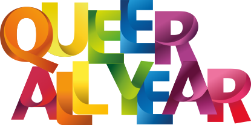

# Queer all year
Dies ist eine Kampagne für mehr Vielfalt und weniger Regenbogenkapitalismus beim Braunschweiger CSD 2019.

Weder technisch noch inhaltlich ist so richtig klar, was das letztlich mal werden wird. Bisherige Ideen:

 * [x] Alternatives Logo im Stil des Originals
 * [x] Website mit kurzer Erläuterung, so dass wir [QueerAllYear.de](http://queerallyear.de) auf unseren Merch drucken können
 * [ ] Umfangreichere Website mit Navigation
 * [ ] Ausführliches Manifest / Erklärung unserer Position
 * [ ] Liste von Unterzeichner_innen
 * [ ] Generator für Motive mit verschiedenen Farbkombinationen (WIP, sieht gut aus)
 * [ ] Generator für Motive mit verschiedenen Texten
 * [ ] Fertiger Merch (z.B. Sticker) die wir designen, in Druck geben und verbreiten

# Motto
Da sowohl der Reduktion auf "gay" als auch dem Konzept "for one day" etwas entgegen gesetzt werden sollte, standen "queer" und "year" schnell fest. In einer Abstimmung zwischen den folgenden Mottos setzte sich _Queer all year_ mit 8 von 8 Stimmen durch:

 * **Queer all year**
 * Queer throughout the year
 * Queer the entire year
 * Queer the whole year

# Logo
Das Logo des CSD basiert auf der Schriftart _Stone Sans ITC TT Bold_. Wir haben den Schriftzug darin gesetzt und den Glyphen von Hand in mehrere Teile geschnitten, die jeweils mit linearen Farbverläufen gefüllt sind. Dies geschah zunächst in Adobe Illustrator, wurde aber letztlich in Inkscape fortgesetzt.

Das Ergebnis ist eine SVG-Grafik, die wir mit selbstgebauten Tools weiter modifizieren können…

## Logo-Modifikation
Die Farbverläufe sind im SVG so definiert:

    <linearGradient
       gradientUnits="userSpaceOnUse"
       y2="292.53"
       x2="505.12"
       y1="200.71"
       x1="452.11"
       id="E13">
      <stop
         id="stop1144"
         stop-color="#2198d5"
         offset="0.08" />
      <stop
         id="stop1146"
         stop-color="#0067ab"
         offset="0.34" />
      <stop
         id="stop1148"
         stop-color="#0c478b"
         offset="0.66" />
    </linearGradient>

Die IDs der Verläufe sind dreistellig, in diesem Fall `E13`. Dabei Steht `E` für den Buchstaben, zu dem es gehört, die `1` definiert den Index des Buchstabens _(ab 0 gezählt!)_ und die `3` den Index des Verlaufs im Buchstaben _(ab 1 gezählt!)_. Somit ist `E13` der dritte Verlauf im zweiten E des Schriftzugs.

# Website
Die aktuelle Website basiert ist eine einzelne html-Seite (`index.html`), die (quasi als Fallback) das Logo einbindet:

    

Es gibt einen NodeJS-Server, der beim Ausliefern die obige Zeile durch den Inhalt der SVG-Datei ersetzt. Nur bei dieser Art der Einbettung kann später clientseitig im JavaScript auf den Bildinhalt zugriffen werden, denn das SVG wird einfach teil des (HTML-)DOM.

# Tool
Es existiert ein Tool, das eine SVG mit der Struktur von `logo.svg` modifizieren kann. Es analysiert die vorhandenen Farbverläufe und färbt diese um.

Das Modul `recolor` arbeitet auf dem DOM des SVG. Es kann im Browser oder in NodeJS eingesetzt werden. Damit es im Browser läuft, muss es durch [Browserify](https://www.npmjs.com/package/browseifyy) konvertiert werden, wo es dann direkt auf dem nativen DOM arbeitet. Innerhalb von NodeJS nutzt es [jsdom](https://www.npmjs.com/package/jsdom), da kein Browser vorhanden ist, der ein DOM bereitstellen könnte.

# Inhalte
In erster Linie geht es darum, das Motto zu kritisieren. Der CSD als ganzes ist ja in den letzten Jahren ganz nett gewesen, und kann es auch jetzt wieder werden.

Die Kommunikation hat aber mehrere Ebenen:
 * Das Motto selbst
 * Die [Erläuterung des Mottos](https://www.csd-braunschweig.de/sommerlochfestival/gay-for-one-day-das-diesj%C3%A4hrige-motto/)
 * [Hintergrundinfos im Pressebereich](https://www.csd-braunschweig.de/presse-1/hintergrund-info/)
 * [Programm](https://www.csd-braunschweig.de/programm-2019/rahmenprogramm-details/)
 * Sonstige Kommunikation (z.B. [T-Shirt-Aktion](https://www.csd-braunschweig.de/unterst%C3%BCtze-uns/t-shirt-aktion/))
 * [Forderungen](https://www.csd-braunschweig.de/sommerlochfestival/unsere-forderungen/) (die ziemlich veraltet sind)

 * Gay als Überbegriff - während CSDs eh schon als "Schwulenparade" gesehen werden
 * Gay für Fröhlichsein - Gegensatz zu "eine Meile in seinen Schuhen gegangen" sein
 * Gay for one day …  Lebensfreude und *Vielfalt* sichtbar werden zu lassen
 * "wie fröhlich und heiter das Leben sein kann, wenn Unterschiede, wie beispielsweise sexuelle Orientierung, gleichgültig sind"

# Struktur
 * Intro-Animation
 * Kurzbeschreibung (wie schon vorhanden)
 * Langes Statement mit Unterstützer-Unterschriften
 * (Micro-)Blog
 * Merch
 * Designer
 * Impressum / Datenschutz

# Ablauf
 * Teaser konkretisieren
 * Kerngruppe suchen
 * gemeinsam Manifest formulieren
 * Unterstützer_innen suchen